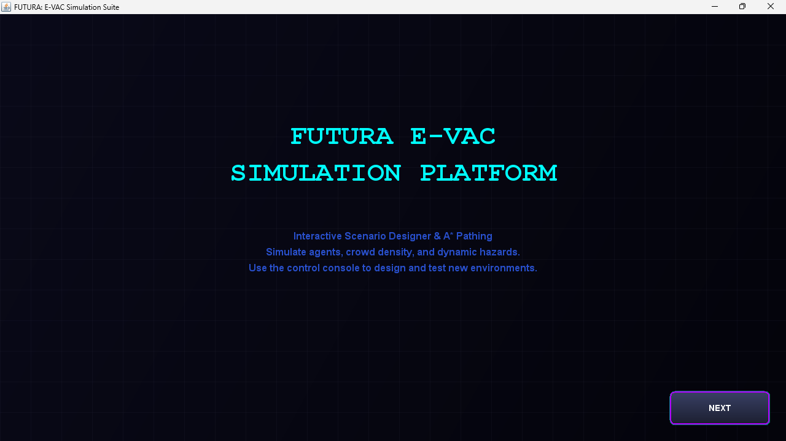
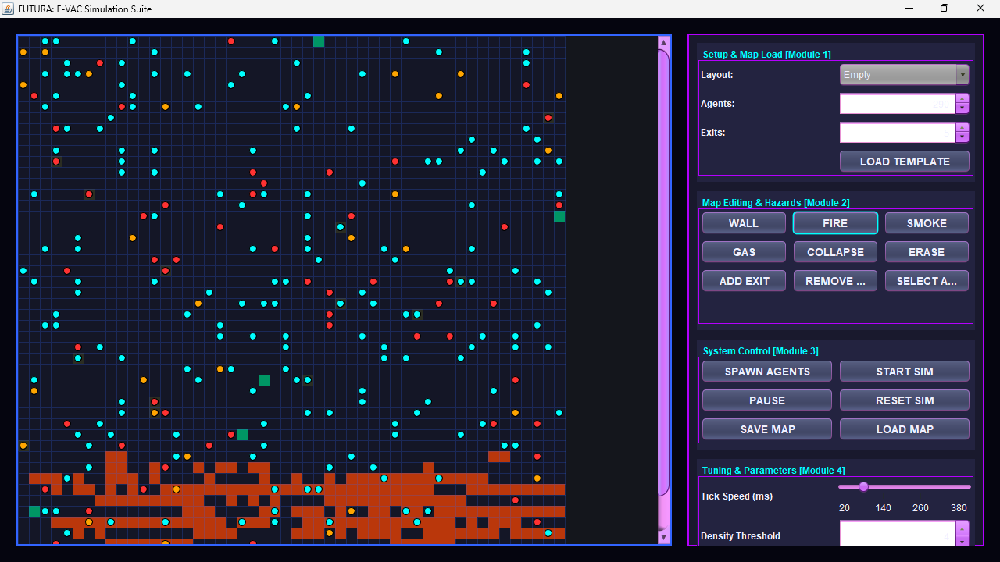
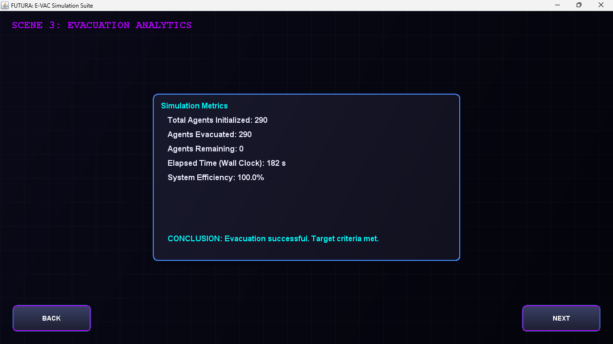
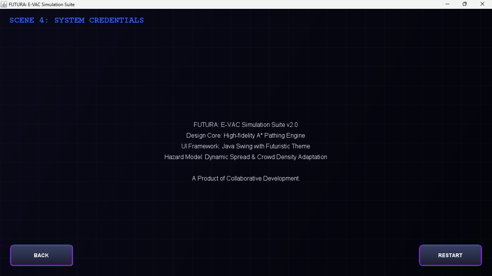

# Emergency Evacuation System

A Java-based emergency evacuation simulation system designed to simulate evacuation scenarios and provide a visual representation of the evacuation process.

## Project Overview

The Emergency Evacuation System is a simulation-based Java project developed to demonstrate how people can be guided toward safer routes during an emergency situation.

The system provides a simulation environment where evacuation-related information can be represented and analyzed.

## Features

* Emergency evacuation simulation
* Visual simulation environment
* Evacuation route representation
* Evacuation analytics
* System credentials interface
* Screenshot-based visualization of the project

## Technology Used

* Java
* Java Swing / GUI
* Object-Oriented Programming (OOP)

## Project Structure

```text
Emergency-Evacuation-System/
|
|-- Screenshots/
|   |-- 01-platform-overview.png.png
|   |-- 02-simulation-environment.png.png
|   |-- 03-evacuation-analytics.png.png
|   `-- 04-system-credentials.png.png
|
|-- src/
|   `-- EmergencyEvacuationSystem.java
|
`-- .gitignore
```

## Project Screenshots

### Platform Overview



### Simulation Environment



### Evacuation Analytics



### System Credentials



## Purpose

The project demonstrates the concept of using software simulation to represent an emergency evacuation scenario and provide information that can assist in understanding evacuation processes.

## Author

**Garvita Agarwal**

B.Tech - Artificial Intelligence & Data Science
